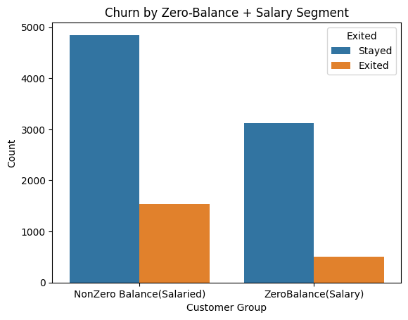
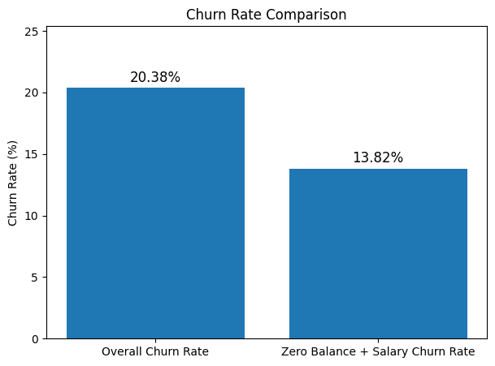
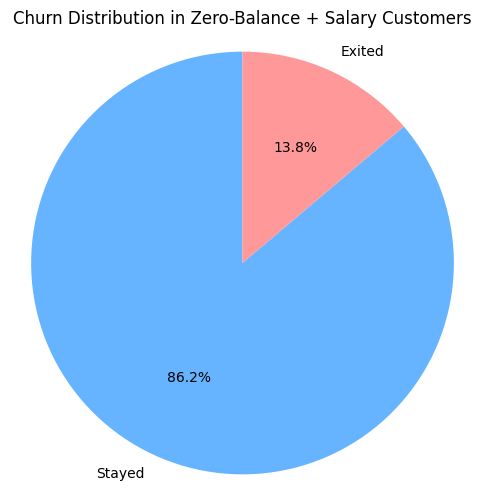
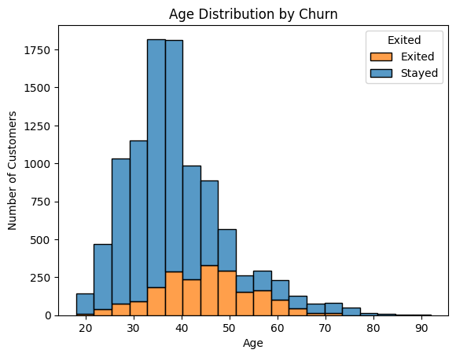
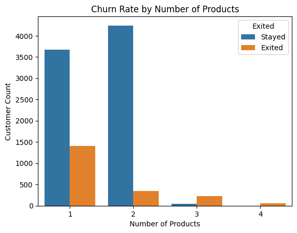
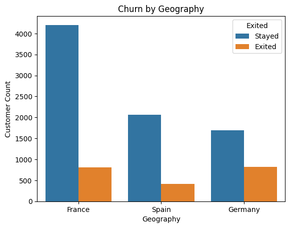
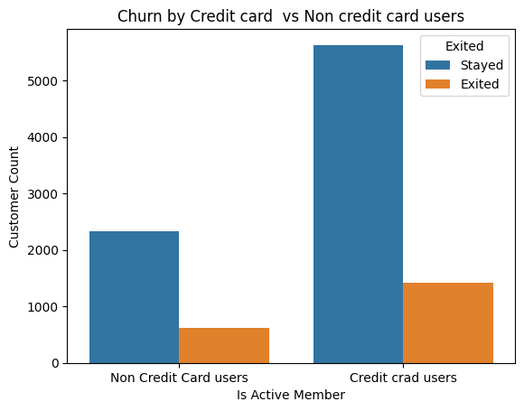
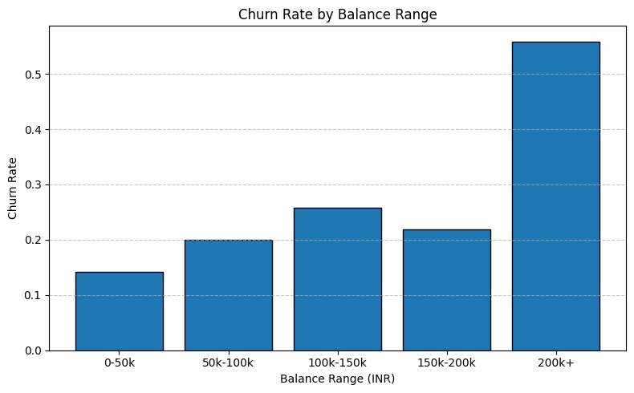

# 📊 Customer Churn Analysis

## 📌 Overview  
This project dives into customer churn behavior using structured data and visual analytics. It explores patterns in **activity level**, **geography**, **tenure**, **balance**, **product usage**, and more to uncover drivers of churn. The aim is to guide targeted retention strategies.

---

## 📂 Dataset  
- **File**: `Churn_Modelling.csv`  
- **Key Columns**:  
  - **Exited** – Whether the customer left  
  - **Geography** – Country (France, Germany, Spain)  
  - **Tenure** – Years with the bank  
  - **IsActiveMember** – Activity flag  
  - **HasCrCard** – Credit card ownership  
  - **Balance** – Account balance  
  - **EstimatedSalary** – Reported salary  
  - **NumOfProducts** – Number of bank products  
  - **Age** – Age of customer  
  - **Gender** – Gender of customer  

---

## 📊 Analysis Performed  
- Churn vs Account Balance & Salary  
- Churn by Geography  
- Churn by Activity Status  
- Churn by Credit Card Ownership  
- Churn by Tenure  
- Churn by Number of Products  
- Churn by Age  
- Churn by Balance

---

## 📊 Visualizations & Insights  

<table>
<tr>
<td align="center"><b>Churn between NonZero Balance(Salaried) vs ZeroBalance(Salaried) customares</b></td>
<td align="center"><b>Overall churn rate Vs Zero Balance + Salary Churn Rate</b></td>
</tr>
<tr>
<td></td>
<td></td>
</tr>
<tr>
<td align="center">13.82% churn even with income — these users possibly use accounts just for salary credit.</td>
<td align="center">Zero Balance Accounts constitutes 13.8% of the overall Churn percentage(20%)</td>
</tr>
</table>

---

<table>
<tr>
<td align="center"><b>Churn in Zero-Balance Acc.</b></td>
<td align="center"><b>Churn by Age</b></td>
</tr>
<tr>
<td></td>
<td></td>
</tr>
<tr>
<td align="center">Its observed that most(86.2) of the Zero Balance Acc. dont churn.</td>
<td align="center">Older customers (50+) churn more — possibly due to lack of personalization.</td>
</tr>
</table>

---

<table>
<tr>
<td align="center"><b>Churn by Number of Products</b></td>
<td align="center"><b>Churn by Geography</b></td>
</tr>
<tr>
<td></td>
<td></td>
</tr>
<tr>
<td align="center">1-product users churn the most — cross-selling helps reduce churn.</td>
<td align="center">Germany shows a relatively higher churn rate compared to France and Spain.</td>
</tr>
</table>

---

<table>
<tr>
<td align="center"><b>Churn by Credit Card users</b></td>
<td align="center"><b>Churn by Balance</b></td>
</tr>
<tr>
<td></td>
<td></td>
</tr>
<tr>
<td align="center">Slightly higher churn among customers with credit cards. — possibly due to hidden charges</td>
<td align="center">High balance doesn’t ensure retention — these customers need better service.</td>
</tr>
</table>

---

## ✅ Key Conclusions  

- **Zero Balance, Has Salary** → Low engagement customers; consider incentives or bundling.  
- **Germany** → High churn region; improve service or support locally.  
- **Zero_Balance Salaried users** → These segment is less likely to churn(Salary Acc / Strategic Users).    
- **1 Product Customers** → Upsell and cross-sell more.  
- **High Balance Customers** → Retain with premium programs.  
- **Credit Card Holders** → Enhance card benefits.  
- **Age 50+** → Personalized service for seniors.

---

## 📜 Author  
👨‍💻 *Sahil Chakraborty*
